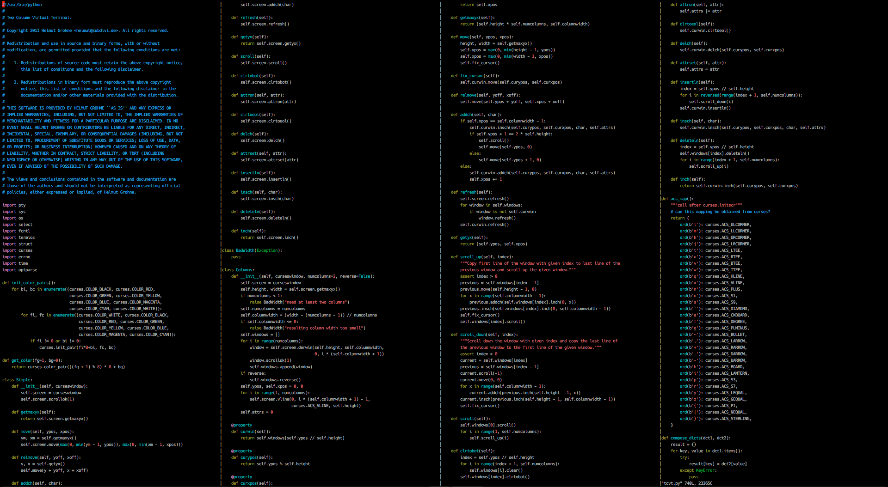

Overview
========
`tcvt` is an ANSI terminal emulator, that turns a `$COLUMNS` x `$LINES` terminal
into a `$COLUMNS/2` x `$LINES*2` terminal. It ships the two commands `tcvt` and
`optcvt` both of which are documented in the accompanying manual page.

Requirements
============
To run tcvt you need a Python 2.6, 2.7 or 3.3. Other than that only standard
Unix tools such as `man`, `make`, `gzip`, `sed` are needed.

License
=======
`tcvt` is published under a [2-clause BSD
license](LICENSE).

Installation
============
To install run `make install` optionally changing variables such as `$DESTDIR`
or `$PREFIX`.

Feedback
========
Should you find bugs, missing features, missing documentation or have any other
question, don't hesitate to contact me (`Helmut Grohne <helmut@subdivi.de>`).
