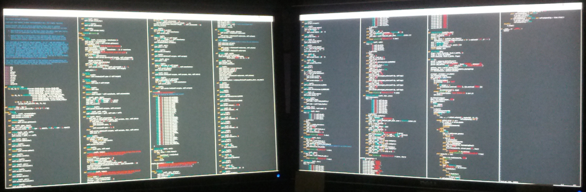

Overview
========
`tcvt` is an ANSI terminal emulator, that turns a `$COLUMNS` x `$LINES` terminal
into a `$COLUMNS/n` x `$LINES*n` terminal of `n` columns. It ships the two
commands `tcvt` and `optcvt` both of which are documented in the accompanying
manual page.

A fullscreen terminal on a full HD screen (1920x1080) can turn into four
columns of 80-159 characters for a single virtual terminal. The picture below
shows `vi` editing the code for `tcvt` on a full-HD screen.

The whole script for `tcvt` is visible on dual 30" monitors.

Requirements
============
To run tcvt you need a Python 2.6, 2.7 or 3.3. Other than that only standard
Unix tools such as `man`, `make`, `gzip`, `sed` are needed.

License
=======
`tcvt` is published under a [2-clause BSD license](LICENSE).

Installation
============
To install run `make install` optionally changing variables such as `$DESTDIR`
or `$PREFIX`.

Feedback
========
Should you find bugs, missing features, missing documentation or have any other
question, don't hesitate to contact me (`Helmut Grohne <helmut@subdivi.de>`).
